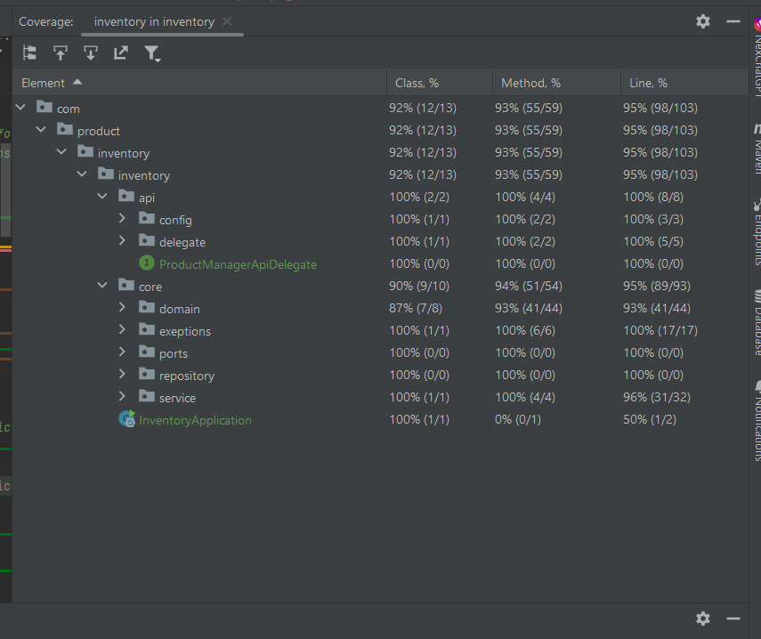

# Summary of the practice


# Exercise

In the company's e-commerce database we have the PRICES table that reflects the final price (pvp) and the rate that applies to a product from
a chain between certain dates. Below is an example of the table with the relevant fields:


[link text](postman/AkkodisTestAlexPostman.postman_collection.json)


PRICES
-------

| BRAND_ID | START_DATE | END_DATE | PRICE_LIST | PRODUCT_ID | PRIORITY | PRICE | CURR |
|----------|------------|----------|------------|------------|----------|-------|------|
| 1 | 2020-06-14 00:00:00 | 2020-12-31 23:59:59 | 1 | 35455 | 0 | 35.50 | EUR |
| 1 | 2020-06-14 15:00:00 | 2020-06-14 18:30:00 | 2 | 35455 | 1 | 25.45 | EUR |
| 1 | 2020-06-15 00:00:00 | 2020-06-15 11:00:00 | 3 | 35455 | 1 | 30.50 | EUR |
| 1 | 2020-06-15 16:00:00 | 2020-12-31 23:59:59 | 4 | 35455 | 1 | 38.95 | EUR |

## Campos

| Nombre | Descripcion |
|--------|-------------|
| BRAND_ID | foreign key of the group string (1 = ZARA). |
| START_DATE,END_DATE | range of dates in which the indicated price rate applies. |
| PRICE_LIST | Applicable price rate identifier. |
| PRODUCT_ID | Product code identifier. |
| PRIORITY | Price application disambiguator. If two rates coincide in a range of dates, the one with the highest priority (highest numerical value) is applied. |
| PRICE | final sale price. |
| CURR | iso of currency |

## caso de uso

It is requested:

Build an application/service in SpringBoot that provides a query rest endpoint such that:

Accept as input parameters: application date, product identifier, string identifier.
Return as output data: product identifier, string identifier, rate to apply, application dates and final price to apply.

You must use an in-memory database (h2 type) and initialize with the data from the example, (you can change the name of the fields and add new ones if you want, choose the type of data that is considered appropriate for them ).

Develop some tests to the rest endpoint that validate the following requests to the service with the data from the example:

- Test 1: request at 10:00 on day 14 of product 35455 for brand 1 (ZARA)
- Test 2: request at 4:00 p.m. on day 14 of product 35455 for brand 1 (ZARA)
- Test 3: request at 9:00 p.m. on day 14 of product 35455 for brand 1 (ZARA)
- Test 4: request at 10:00 on day 15 of product 35455 for brand 1 (ZARA)
- Test 5: request at 9:00 p.m. on the 16th of product 35455 for brand 1 (ZARA)


# postman
[Test Posman 2023-08-04 131545.png](gen/Test Posman 2023-08-04 131545.png)
[AkkodisTestAlexPostman.postman_collection.json](postman/AkkodisTestAlexPostman.postman_collection.json)

# specs
[openapi.yaml](specs%2Fopenapi.yaml)
[Swagger-ui/index.html](http://localhost:8080/swagger-ui/index.html)


# Coverage



###  Build and Run application
[]()
_GOTO >_ **~/absolute-path-to-directory/inventory**  
and try below command in terminal
> **```mvn spring-boot:run```** it will run application as spring boot application


or
> **```mvn clean install```** it will build application and create **jar** file under target directory

Run jar file from below path with given command
> **```java -jar ~/path-to-inventory/target/inventory-0.0.1-SNAPSHOT.jar```**


# Getting Started

### Reference Documentation

For further reference, please consider the following sections:

* [Official Apache Maven documentation](https://maven.apache.org/guides/index.html)
* [Spring Boot Maven Plugin Reference Guide](https://docs.spring.io/spring-boot/docs/3.1.2/maven-plugin/reference/html/)
* [Create an OCI image](https://docs.spring.io/spring-boot/docs/3.1.2/maven-plugin/reference/html/#build-image)
* [Spring Boot DevTools](https://docs.spring.io/spring-boot/docs/3.1.2/reference/htmlsinge/index.html#using.devtools)
* [Spring Configuration Processor](https://docs.spring.io/spring-boot/docs/3.1.2/reference/htmlsinge/index.html#appendix.configuration-metadata.annotation-processor)
* [Spring Reactive Web](https://docs.spring.io/spring-boot/docs/3.1.2/reference/htmlsinge/index.html#web.reactive)
* [Spring Web](https://docs.spring.io/spring-boot/docs/3.1.2/reference/htmlsinge/index.html#web)

### Guides

The following guides illustrate how to use some features concretely:

* [Building a Reactive RESTful Web Service](https://spring.io/guides/gs/reactive-rest-service/)
* [Building a RESTful Web Service](https://spring.io/guides/gs/rest-service/)
* [Serving Web Content with Spring MVC](https://spring.io/guides/gs/serving-web-content/)
* [Building REST services with Spring](https://spring.io/guides/tutorials/rest/)

